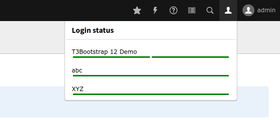

# 🔴 Nur für Tests geeignet! 🔴

# multisite-belogin
TYPO3 Extension for automatic cross domain backend login. The editor now can use the backend tools in frontend like preview.

## Screenshots

Each bar represents one language of a site. With green it worked, with red something went wrong.

## Installation

* Install the extension via composer/TER
* Set in backend the installation-wide option '[BE][cookieSameSite] = none'
* All bases of sites must have a full qualified domain name (FQDN) like 'https://www.foo.com/' or 'https://www.bar.com'
* You must login to backend with https and on a site domain

## TODOs

* generate TypeScript files
